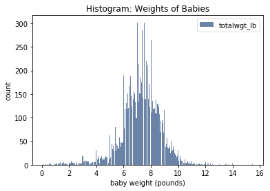
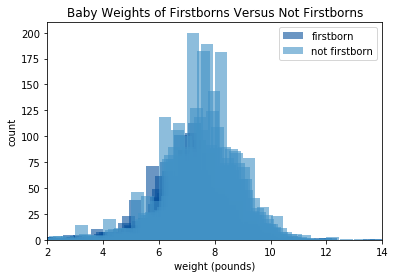

[Think Stats Chapter 2 Exercise 4](http://greenteapress.com/thinkstats2/html/thinkstats2003.html#toc24) (Cohen's d)

>> The Cohen effect size is 0.069 standard deviations, which is a large effect. This value is a little over double 
the value for the Cohen effect size for pregnancy length. 

### Further insights into this question

Code to generate a graph for a histogram of baby weights.

```
preg = nsfg.ReadFemPreg()  # preg is our dataframe
totalwgt_lb = preg['totalwgt_lb']
hist_totalwgt_lb = thinkstats2.Hist(totalwgt_lb, label='totalwgt_lb')
thinkplot.Hist(hist_totalwgt_lb)
thinkplot.Config(title='Histogram: Weights of Babies', xlabel='baby weight (pounds)', ylabel='count')
```



Statistics summary of baby weights:

```
totalwgt_lb.size
totalwgt_lb.mean()
totalwgt_lb.var()
totalwgt_lb.std()
```

We analyzed a sample of 13593 babies. The mean baby weight is approximately 7.27 pounds. The variance is 1.98 pounds.
The standard deviation is 1.41 pounds. Based on this data and the graph, it seems baby weights are generally clustered 
around the mean. The graph also shows some far-out baby weights around 1 pound and even 14 pounds.

We can examine the potential outliers.

```
for lbs, count in hist_totalwgt_lb.Largest(10):
    print(lbs, count)
```

This code above generates the 10 heaviest babies - the heaviest being 15.4375 pounds.

```
for lbs, count in hist_totalwgt_lb.Smallest(20):
    print(lbs, count)
```

This code above generates the 10 lightest babies - the lightest being 0.125 pounds. These extremely small values below 
20 pounds seem fairly unlikely that the baby would be born and live past a few weeks. This dataset includes all 
pregnancies - whether the outcome value is 1 (a successful birth) or instances of a premature baby that may not have 
been born in good condition. So these small weights could have been accurately recorded by nurses or doctors, yet not
justified as successful pregnancies.

From our entire set of baby weights, we can filter by those which are firstborn by a mother versus those which are not
 firstborn by a mother. 

```
firsts_weights = preg[preg.pregordr==1].totalwgt_lb
non_firsts_weights = preg[preg.pregordr!=1].totalwgt_lb

firsts_weights_hist = thinkstats2.Hist(firsts_weights, label='firstborn')
non_firsts_weights_hist = thinkstats2.Hist(non_firsts_weights, label='not firstborn')
```

We can generate a plot of baby weights of firstborns versus not firsborns.

```
width = 0.45
thinkplot.PrePlot(2)
thinkplot.Hist(firsts_weights_hist, align='right', width=width)
thinkplot.Hist(non_firsts_weights_hist, align='left', width=width)
thinkplot.Config(title='Baby Weights of Firstborns Versus Not Firstborns', xlabel='weight (pounds)', ylabel='count', xlim=[2,14])
```



```
mean_diff = firsts_weights.mean() - non_firsts_weights.mean()
std_dev_diff = firsts_weights.std() - non_firsts_weights.std()
```

The mean difference between groups is -.097 pounds. The standard deviation difference between groups is 0.01 pounds. 
Non-firstborn babies have a slightly higher mean baby weight of .097 pounds.

```
def CohenEffectSize(group1, group2):
    """Computes Cohen's effect size for two groups.
    The difference in means expressed in number of std deviations
    group1: Series or DataFrame
    group2: Series or DataFrame
    
    returns: float if the arguments are Series;
             Series if the arguments are DataFrames
    """
    diff = group1.mean() - group2.mean()

    var1 = group1.var()
    var2 = group2.var()
    n1, n2 = len(group1), len(group2)

    pooled_var = (n1 * var1 + n2 * var2) / (n1 + n2)  # avg variance between two groups
    d = diff / np.sqrt(pooled_var)  # 
    return d
    
CohenEffectSize(firsts_weights, non_firsts_weights)   
```

The Cohen effect size is 0.069 standard deviations.
