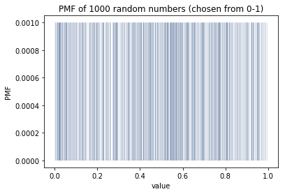

[Think Stats Chapter 4 Exercise 2](http://greenteapress.com/thinkstats2/html/thinkstats2005.html#toc41) (a random distribution)

>> 

>> This probability mass function above is trying to display 1000 distinct vertical lines to represent the probability 
of selecting each of our 1000 random points. 1000 values is a very large sample size to display on such a small graph 
width size. There's a lot of overlap and it's tough to visually gauge the probability of selecting each value. This graph
 is not a good representation of illustrating the probability of selecting values. If we were to group these random
  variables into bins of non-overlapping intervals, we could plot the bins and see more useful information on our graph.
  
>> 

>> This CDF above is a more accurate representation to plot the percentile ranking of our randomly generated 1000 
numbers. Yes, this CDF is a uniform distribution. There seems to a constant-slope line from the bottom left of the 
graph at (0,0) to the top right (1, 1). This would equate to a rectangular probabibility graph so for any random value 
in the range 0 to 1, there seems to be an equal probability we'd select any two values. While the line isn't perfectly 
straight, the larger the sample size of random numbers between 0-1 we choose, such as 1000000 rather than 1000, the 
straighter line we'd see.